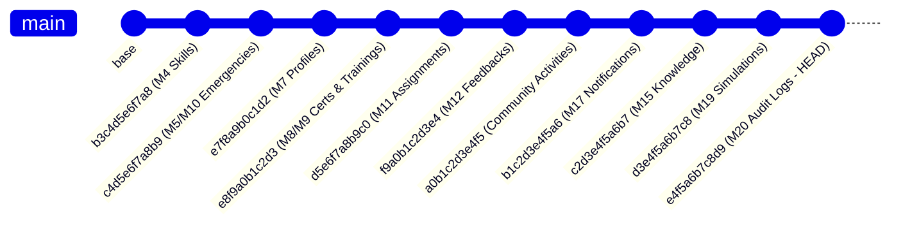

# Community Skill Bank — Backend Complete Technical Documentation (Modules 1–20)

---

## 1. Project Overview & Architectural Vision

The **Community Skill Bank for Disaster & Emergency Response** is an enterprise-grade, high-availability backend platform designed for municipal disaster management authorities, emergency response coordinators, and citizen volunteers.

### Key Architectural Pillars:
1. **Deterministic & Explainable Intelligence**: Algorithmic decision systems (candidate matching, volunteer recommendation, emergency intelligence, and disaster simulation) use deterministic, rule-based mathematical scoring without unverified generative AI or hallucination risk.
2. **Offline-First & Degraded Network Resilience**: First responders in disaster areas with poor connectivity can operate offline and synchronize batches through server-authoritative conflict resolution feeds.
3. **Enterprise Auditability & Observability**: Every security-sensitive action, administrative change, and lifecycle dispatch is immutably logged with correlation request IDs, sanitized credentials, and decoupled non-blocking failure semantics.
4. **Data Privacy & IDOR Protection**: Strict tenant isolation, ownership guards, and spatial coordinate privacy protect volunteers and incident reporters.

---

## 2. Technical Stack & Infrastructure

- **Language & Runtime**: Python 3.13+
- **Web Framework**: FastAPI (Async ASGI)
- **Database**: PostgreSQL (Production) / SQLite In-Memory (Automated Testing)
- **ORM & Data Layer**: SQLAlchemy 2.0 (Declarative Mapping, Unit-of-Work, Connection Pooling)
- **Database Migrations**: Alembic (Additive, zero data-loss migration lineage)
- **Data Validation & Serialization**: Pydantic v2 (Strict typing, extra-attribute forbidden guards)
- **Authentication & Security**: JWT (JSON Web Tokens) with `HS256`, Argon2 / Passlib Bcrypt hashing
- **Real-Time Communication**: Native asynchronous WebSocket connection manager with user-scoped message routing
- **Observability**: Contextual `X-Request-ID` correlation middleware, structured logging, in-process latency/throughput metrics collector, and health probes

---

## 3. High-Level System Architecture

```mermaid
graph TD
    subgraph Core Foundation [Modules 1-4]
        M1[Module 1: DB & FastAPI Core]
        M2[Module 2: JWT Auth & RBAC]
        M3[Module 3: User Management]
        M4[Module 4: Skill Taxonomy]
    end

    subgraph Operations & Matching [Modules 5-10]
        M5[Module 5: Emergency Geolocation & Haversine]
        M6[Module 6: 100-Pt Matching Engine]
        M7[Module 7: Volunteer Operational Profiles]
        M8[Module 8: Certifications & Verification]
        M9[Module 9: Training Programs & Readiness]
        M10[Module 10: Emergency Staffing Requirements]
    end

    subgraph Coordination & Intelligence [Modules 11-16]
        M11[Module 11: Assignment Lifecycle State Machine]
        M12[Module 12: Feedback & Trust Ratings]
        M13[Module 13: Emergency Intelligence Engine]
        M14[Module 14: Explainable Recommendation Engine]
        M15[Module 15: Knowledge Base & RAG Foundation]
        M16[Module 16: Analytics & Dashboards]
    end

    subgraph Realtime, Offline & Hardening [Modules 17-20]
        M17[Module 17: WebSocket Hub & Notifications]
        M18[Module 18: Offline Sync & Conflict Resolution]
        M19[Module 19: Disaster Simulation Engine]
        M20[Module 20: Audit Trail & Observability]
    end

    Core Foundation --> Operations & Matching
    Operations & Matching --> Coordination & Intelligence
    Coordination & Intelligence --> Realtime, Offline & Hardening
```

---

## 4. Comprehensive Module Breakdown (Modules 1–20)

### Module 1: Project Foundation & Database Core
- **Purpose**: Initializes the core FastAPI application, database configuration, connection pooling, and declarative base model architecture.
- **Key Components**:
  - `app/main.py`: ASGI application entry point, CORS middleware, lifespan events.
  - `app/database/database.py`: SQLAlchemy session engine, pooling configuration.
  - `app/database/base.py`: Declarative base metadata.

---

### Module 2: Authentication & Role-Based Access Control (RBAC)
- **Purpose**: Secure registration, login, token creation, password hashing, and role authorization.
- **Roles Supported**: `admin`, `skilled_volunteer`, `citizen_volunteer`, `volunteer`.
- **Key Endpoints**:
  - `POST /api/auth/register`: New user registration with email deduplication.
  - `POST /api/auth/login`: Issue JWT bearer token with expiry claims.
  - `GET /api/auth/me`: Authenticated user identity introspection.
- **Security Features**: Constant-time password validation, tamper-proof bearer tokens, role dependencies (`get_current_user`, `get_current_admin`).

---

### Module 3: User Management & Administrative Control
- **Purpose**: Administrative user lifecycles, account activations, and administrative role promotions.
- **Key Endpoints**:
  - `GET /api/admin/users`: Paginated list of registered users with role and status filtering.
  - `PATCH /api/admin/users/{id}/role`: Modify user role with audit logging (`USER_ROLE_CHANGE`).
  - `PATCH /api/admin/users/{id}/status`: Activate or deactivate user accounts.

---

### Module 4: Skill Taxonomy & Volunteer Skill Inventory
- **Purpose**: Structured taxonomy of disaster-response skills with defined proficiency tiers.
- **Proficiency Tiers**: `beginner` (1), `intermediate` (2), `advanced` (3), `expert` (4).
- **Key Model**: `Skill` (`id`, `user_id`, `category`, `title`, `proficiency`, `years_experience`).
- **Key Endpoints**:
  - `POST /api/skills`: Add skill to authenticated volunteer profile.
  - `GET /api/skills/mine`: List authenticated volunteer's skills.
  - `DELETE /api/skills/{id}`: Delete volunteer skill record.

---

### Module 5: Emergency Incident Reporting & Geolocation
- **Purpose**: Real-time logging of emergency incidents with geographic coordinates and severity tagging.
- **Spatial Algorithm**: Great-Circle **Haversine Formula**:
  $$\Delta\sigma = 2 \arcsin \sqrt{\sin^2\left(\frac{\Delta\phi}{2}\right) + \cos\phi_1 \cos\phi_2 \sin^2\left(\frac{\Delta\lambda}{2}\right)}$$
  $$d = R \cdot \Delta\sigma \quad (R = 6371.0\text{ km})$$
- **Key Model**: `Emergency` (`title`, `description`, `category`, `severity`, `status`, `latitude`, `longitude`, `reporter_id`).
- **Key Endpoints**:
  - `POST /api/emergencies`: Create emergency incident.
  - `GET /api/emergencies`: List incidents with status/category/severity filtering.
  - `GET /api/emergencies/{id}/nearby-volunteers`: Find volunteers within radius $R$ km.
  - `PATCH /api/emergencies/{id}/status`: Update incident status (`open`, `in_progress`, `resolved`, `cancelled`).

---

### Module 6: Rule-Based Volunteer Matching Engine
- **Purpose**: Two-stage deterministic 100-point explainable matching algorithm.
- **Stage 1 (Hard Eligibility Constraints)**:
  - Account is active (`is_active = True`).
  - Eligible volunteer role (`skilled_volunteer`, `citizen_volunteer`, `volunteer`).
  - Geographic distance $\le \min(\text{radius\_km}, \text{volunteer.max\_travel\_distance\_km})$.
  - Skill competency matches requirement criteria.
- **Stage 2 (100-Point Scoring Model)**:
  - **Skill Category Match**: 40 points
  - **Proficiency Tier Match**: 25 points ($\text{score} = 25 \times \frac{\text{vol\_tier}}{\text{req\_tier}}$ capped at 25)
  - **Experience Level**: 15 points ($\text{score} = \min(15, \text{years} \times 3)$)
  - **Proximity**: 20 points ($\text{score} = 20 \times \left(1 - \frac{\text{dist}}{\text{radius}}\right)$)
- **Key Endpoint**:
  - `GET /api/emergencies/{id}/match-volunteers`: Ranked volunteer recommendations with score breakdowns.

---

### Module 7: Volunteer Operational Profiles & Travel Constraints
- **Purpose**: Capture operational availability, transportation capabilities, and maximum travel distances.
- **Key Model**: `VolunteerProfile` (`user_id`, `availability_status`, `transportation_mode`, `max_travel_distance_km`, `medical_training_flag`).
- **Key Endpoints**:
  - `GET /api/volunteer-profiles/me`: View volunteer operational settings.
  - `PUT /api/volunteer-profiles/me`: Update travel capacity and availability.

---

### Module 8: Volunteer Certifications & Administrative Verifications
- **Purpose**: Document and officially verify professional credentials (e.g., EMT, Drone Pilot, Heavy Machinery).
- **Verification Lifecycle**: `pending` $\rightarrow$ `verified` / `rejected`.
- **Key Model**: `VolunteerCertification` (`user_id`, `credential_id`, `issuing_organization`, `issue_date`, `expiry_date`, `verification_status`).
- **Key Endpoints**:
  - `POST /api/certifications`: Submit credential for review.
  - `PATCH /api/admin/certifications/{id}/verify`: Admin verify credential with audit logging (`CERTIFICATION_VERIFY`).

---

### Module 9: Volunteer Training Programs & Readiness Tracking
- **Purpose**: Track disaster preparedness training programs and renewal validity periods.
- **Key Model**: `VolunteerTraining` (`user_id`, `training_title`, `institution`, `completion_date`, `validity_years`, `verification_status`).
- **Key Endpoints**:
  - `POST /api/trainings`: Record training completion.
  - `PATCH /api/admin/trainings/{id}/verify`: Admin verify training record with audit logging (`TRAINING_VERIFY`).

---

### Module 10: Emergency Staffing Requirements & Urgency Tiers
- **Purpose**: Define multi-skill staffing quotas and urgency levels per emergency incident.
- **Key Model**: `EmergencyRequirement` (`emergency_id`, `skill_category`, `skill_title`, `min_proficiency`, `urgency`, `min_volunteers_needed`).
- **Key Endpoints**:
  - `POST /api/emergencies/{id}/requirements`: Add staffing requirement quota.
  - `GET /api/emergencies/{id}/requirements`: List incident skill requirements.
  - `PATCH /api/emergencies/{id}/requirements/{req_id}`: Modify requirement quota.
  - `DELETE /api/emergencies/{id}/requirements/{req_id}`: Remove requirement.

---

### Module 11: Response & Assignment Lifecycle Management
- **Purpose**: Concurrency-safe, deterministic state machine governing volunteer assignment, on-scene check-in, completion, and standdown.
- **State Machine Flow**:
  ```
  [Volunteer Self-Apply] --> PENDING  --> ACCEPTED  --> ASSIGNED  --> IN_PROGRESS --> COMPLETED
  [Authority Direct-Dispatch] ------------------------> ASSIGNED -------^
  [Authority Standdown / Cancellation] ---------------------------------------------> CANCELLED
  ```
- **Concurrency Safety**: Unique database constraint `(emergency_id, volunteer_id)` prevents race conditions and duplicate assignments.
- **Key Endpoints**:
  - `POST /api/emergencies/{id}/respond`: Volunteer self-apply or respond to invitation.
  - `POST /api/emergencies/{id}/assignments`: Authority direct dispatch or invite.
  - `PATCH /api/assignments/{id}/progress`: Volunteer update progress (`assigned` $\rightarrow$ `in_progress` $\rightarrow$ `completed`).
  - `POST /api/emergencies/{id}/assignments/{id}/cancel`: Incident commander soft cancellation.
  - `GET /api/emergencies/{id}/assignments`: Incident assignment overview with requirement fulfillment counts.

---

### Module 12: Assignment Feedback & Trust Ratings
- **Purpose**: Mutual post-deployment ratings and performance reviews between incident commanders and volunteers.
- **Key Model**: `AssignmentFeedback` (`assignment_id`, `rater_id`, `ratee_id`, `rating_score`, `feedback_comments`).
- **Key Endpoints**:
  - `POST /api/assignments/{id}/feedback`: Submit post-mission rating (1–5 scale).
  - `GET /api/volunteers/{id}/ratings`: Retrieve aggregate trust score and review history.

---

### Module 13: Emergency Intelligence Engine
- **Purpose**: Deterministic operational assessment of emergency incidents without generative hallucination.
- **Capabilities**:
  - Automatic extraction of required skills and peak urgency.
  - Headcount fulfillment ratio calculation against active assignments.
  - Geographic coordinate integrity validation and risk anomaly flags.
- **Key Endpoint**:
  - `GET /api/emergencies/{id}/intelligence`: Incident intelligence summary.

---

### Module 14: Explainable Volunteer Recommendations
- **Purpose**: Prioritized candidate recommendations tailored to unfulfilled, high-urgency requirements.
- **Features**:
  - Reuses authoritative Module 6 matching scores.
  - Excludes already-assigned volunteers to eliminate double-booking.
  - Prioritizes candidates with verified certifications (Module 8) and high trust ratings (Module 12).
- **Key Endpoint**:
  - `GET /api/emergencies/{id}/recommendations`: Prioritized candidate list with explainable rationale strings.

---

### Module 15: Knowledge Base & RAG Retrieval Foundation
- **Purpose**: Knowledge retrieval substrate for disaster operating procedures, protocols, and triage guides.
- **Search Architecture**: PostgreSQL Full-Text Search (`to_tsvector` / `plainto_tsquery`) + deterministic token matching.
- **Key Model**: `KnowledgeDocument` (`title`, `category`, `content`, `tags_json`, `is_published`, `author_id`).
- **Key Endpoints**:
  - `POST /api/knowledge`: Create protocol document (Admin only).
  - `GET /api/knowledge/search`: Retrieve documents ranked by text relevance.
  - `GET /api/knowledge/{id}`: View protocol document.

---

### Module 16: Analytics & Operational Dashboards
- **Purpose**: Aggregated situational awareness metrics for disaster control rooms.
- **Metrics Calculated**:
  - Emergency incident counts by status and severity distribution.
  - Volunteer force size, role distribution, and coordinate readiness.
  - Skill inventory depth and requirement fulfillment gap analysis.
- **Key Endpoints**:
  - `GET /api/analytics/emergencies`: Incident statistics summary.
  - `GET /api/analytics/volunteers`: Volunteer capacity statistics.
  - `GET /api/analytics/skills`: Skill taxonomy coverage metrics.

---

### Module 17: Real-Time Communication & In-App Notifications
- **Purpose**: Real-time event broadcasting and persistent user notifications.
- **Architecture**:
  - `ConnectionManager`: Thread-safe in-memory WebSocket connection registry.
  - `Notification`: Database-backed user inbox with unread counts and read timestamps.
- **Key Endpoints**:
  - `WS /api/ws`: WebSocket endpoint with JWT token authentication.
  - `GET /api/notifications`: User notification inbox.
  - `GET /api/notifications/unread-count`: Badge count of unread notifications.
  - `PATCH /api/notifications/{id}/read`: Mark notification as read.
  - `POST /api/admin/notifications/broadcast`: Broadcast administrative announcement with audit logging (`NOTIFICATION_BROADCAST`).

---

### Module 18: Offline / PWA Backend Support
- **Purpose**: Enable field operations in degraded connectivity environments.
- **Features**:
  - Delta change feeds (`/api/sync/changes`) returning entities updated on or after timestamp $T$.
  - Batch action synchronization (`POST /api/sync`) with server-authoritative conflict resolution (cancelled assignments, capacity limits).
  - Idempotent action deduplication via `client_action_id`.
- **Key Endpoints**:
  - `GET /api/sync/changes`: Incremental delta changefeed for emergencies, assignments, and activities.
  - `GET /api/sync/notifications`: Notification catch-up since reconnect.
  - `POST /api/sync`: Batch offline action replay with conflict audit logging (`SYNC_CONFLICT`).

---

### Module 19: Disaster Simulation Engine
- **Purpose**: Deterministic hypothetical disaster modeling for capacity planning and preparedness exercises.
- **Simulation Capabilities**:
  - Incident demand multiplication across spatial radius $R$.
  - Spatial volunteer filtering against individual travel distance limits.
  - Skill gap calculation (simulated demand vs. eligible matching capacity).
  - Response pressure classification (`low`, `moderate`, `high`, `critical`).
  - Time-step progression timeline (mobilization curve from $T_0$ to $T_{\text{max}}$).
- **Key Endpoints**:
  - `POST /api/simulations`: Create disaster scenario.
  - `POST /api/simulations/{id}/run`: Execute deterministic simulation model with audit logging (`SIMULATION_RUN`).
  - `GET /api/simulations/{id}/results`: View simulation results and skill gaps.
  - `GET /api/simulations/{id}/timeline`: Retrieve time-step progression breakdown.

---

### Module 20: Audit Trail & Enterprise Observability
- **Purpose**: Immutable audit trail, structured diagnostics, correlation tracking, and safe error masking.
- **Key Features**:
  - Append-only `audit_logs` table with composite indexes (`action`, `entity_type`, `timestamp`).
  - Contextual `X-Request-ID` correlation middleware auto-generating or safely propagating UUIDs.
  - Automatic credential and token redaction (`sanitize_log_data`).
  - Centralized safe 500 error handler masking internal stack traces.
  - In-process `MetricsCollector` tracking requests, latency averages, and error status distributions.
  - Non-blocking audit failure semantics: Audit DB write errors log errors without rolling back or aborting primary business mutations.
- **Audited Events**:
  - `AUTH_LOGIN_SUCCESS`, `AUTH_LOGIN_FAILURE`
  - `USER_ROLE_CHANGE`
  - `CERTIFICATION_VERIFY`, `TRAINING_VERIFY`
  - `EMERGENCY_STATUS_CHANGE`
  - `ASSIGNMENT_STATUS_CHANGE`, `ASSIGNMENT_CANCEL`
  - `NOTIFICATION_BROADCAST`
  - `SIMULATION_RUN`
  - `SYNC_CONFLICT`
- **Key Endpoints**:
  - `GET /api/admin/audit-logs`: Filterable audit log stream (Admin only).
  - `GET /api/admin/metrics`: Operational metrics snapshot.
  - `GET /health`: Liveness probe.
  - `GET /ready`: Database connectivity readiness probe.

---

## 5. Database Schema & Migration Lineage



### Complete Migration History:
1. `b3c4d5e6f7a8`: Add experience & proficiency to skills table.
2. `c4d5e6f7a8b9`: Add emergency requirements & incident severity classifications.
3. `e7f8a9b0c1d2`: Add volunteer operational profiles & travel constraints.
4. `e8f9a0b1c2d3`: Add volunteer certifications & training programs.
5. `d5e6f7a8b9c0`: Add emergency assignments lifecycle & timestamps.
6. `f9a0b1c2d3e4`: Add assignment feedback & trust rating models.
7. `a0b1c2d3e4f5`: Add community activities & volunteer participation records.
8. `b1c2d3e4f5a6`: Add in-app notification inbox & broadcast tables.
9. `c2d3e4f5a6b7`: Add disaster knowledge base documents & search indexing.
10. `d3e4f5a6b7c8`: Add disaster simulation scenarios, requirements & results.
11. **`e4f5a6b7c8d9` (Current HEAD)**: Add append-only audit trail logs table with composite query indexing.

---

## 6. Security, Privacy & Reliability Guarantees

- **Credential Redaction**: Passwords, hashes, JWTs, refresh tokens, and Authorization headers are automatically sanitized (`[REDACTED]`) before appearing in audit metadata or application logs.
- **IDOR Protection**: All user queries (notifications, assignments, certifications) enforce ownership boundaries (`user_id == current_user.id`).
- **Coordinate Privacy**: Exact volunteer residential coordinates are never exposed in public endpoints or unredacted log lines.
- **Transaction Safety**: All business mutations are committed prior to writing audit log rows. Audit log write failures log errors without rolling back or aborting primary business mutations.
- **Fail-Safe Exception Handling**: Centralized 500 error interception prevents database table names, SQL errors, or backend stack traces from leaking to client responses.

---

## 7. Verification & Status Metrics

| Metric | Status |
|---|---|
| **Module Test Suites Passed** | **20 / 20 (100%)** |
| **Module 20 Dedicated Tests** | **53 / 53 (100%)** |
| **Live Database Users** | **19** |
| **Live Database Skills** | **14** |
| **Live Database Emergencies** | **12** |
| **Audit Log Call Sites Safety** | **SAFE** (100% committed before audit recording) |
| **Alembic Head Revision** | **`e4f5a6b7c8d9`** |
