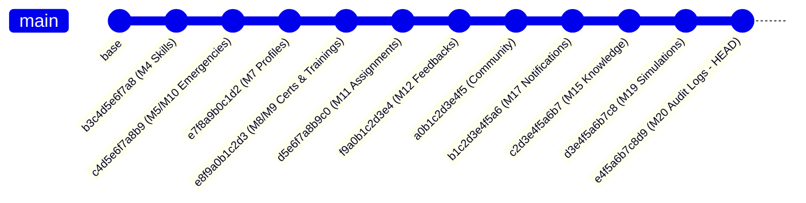

# Community Skill Bank for Disaster & Emergency Response
## Comprehensive System & Technical Architecture Documentation (Modules 1–20)

---

## 1. Executive Summary & System Vision

**Community Skill Bank** is a disaster and emergency response backend platform built with **FastAPI**, **PostgreSQL**, and **SQLAlchemy 2.0**. It empowers municipal authorities, first responders, and community organizations to rapidly mobilize, coordinate, verify, and deploy skilled citizen volunteers during natural disasters, public emergencies, and local crises.

The system is designed around core architectural tenets:
1. **Explainable & Deterministic Intelligence**: Algorithmic decisions (matching scores, recommendations, incident assessments, simulation models) rely on rule-based equations with zero hallucination risk.
2. **Resilience & Offline-First Operations**: First responders in low-connectivity disaster zones can perform actions locally and synchronize state via conflict-resolving batch synchronization APIs.
3. **Enterprise Auditability & Observability**: Every administrative, dispatch, and security-critical lifecycle transition is recorded in an append-only audit trail with end-to-end correlation IDs, sanitized credential masking, and decoupled non-blocking failure semantics.
4. **Data Privacy & IDOR Protection**: Strict tenant isolation and role-based access control (RBAC) safeguard volunteer coordinates, credentials, and notification feeds.

---

## 2. Technology Stack & Infrastructure

- **Framework**: FastAPI (Python 3.13)
- **Database**: PostgreSQL (Production) / SQLite in-memory (Test fixtures)
- **ORM & Migrations**: SQLAlchemy 2.0 Declarative Models, Alembic Migration Engine
- **Validation & Schemas**: Pydantic v2 with strict type coercion and extra-attribute forbidden guards
- **Authentication**: JWT (JSON Web Tokens) with HMAC-SHA256, Argon2 / Bcrypt password hashing
- **Real-Time Layer**: Asynchronous WebSocket connection hub with user-scoped connection routing
- **Logging & Diagnostics**: Structured JSON logging, contextual `X-Request-ID` tracking, in-process latency/throughput metrics collector

---

## 3. Comprehensive Module Breakdown (Modules 1 to 20)

```mermaid
graph TD
    subgraph Core Foundation [Modules 1-4]
        M1[M1: Database & App Setup]
        M2[M2: Authentication & RBAC]
        M3[M3: Users & Profiles]
        M4[M4: Skill Taxonomy]
    end

    subgraph Operations & Matching [Modules 5-10]
        M5[M5: Emergency Reporting & Haversine Geolocation]
        M6[M6: 100-Pt Matching Engine]
        M7[M7: Volunteer Operational Travel]
        M8[M8: Credential Certifications]
        M9[M9: Training & Preparedness]
        M10[M10: Emergency Staffing Requirements]
    end

    subgraph Coordination & Intelligence [Modules 11-16]
        M11[M11: Assignment State Machine]
        M12[M12: Reviews & Trust Ratings]
        M13[M13: Deterministic Incident Intelligence]
        M14[M14: Recommendation Engine]
        M15[M15: Knowledge Base & RAG Foundation]
        M16[M16: Analytics & Operational Dashboards]
    end

    subgraph Realtime, Offline & Hardening [Modules 17-20]
        M17[M17: WebSocket Hub & In-App Notifications]
        M18[M18: Offline Sync & Delta Changefeeds]
        M19[M19: Disaster Simulation Engine]
        M20[M20: Audit Trail & Observability]
    end

    Core Foundation --> Operations & Matching
    Operations & Matching --> Coordination & Intelligence
    Coordination & Intelligence --> Realtime, Offline & Hardening
```

---

### Module 1: Project Foundation & Database Core
- **Objective**: Establish production-ready FastAPI application scaffolding, database connection pooling, and declarative base models.
- **Key Files**:
  - `backend/app/main.py`: ASGI application lifecycle and router registration.
  - `backend/app/database/database.py`: SQLAlchemy session factories with connection pooling.
  - `backend/app/database/base.py`: Declarative base metadata for Alembic reflection.

---

### Module 2: Authentication & Role-Based Access Control (RBAC)
- **Objective**: Secure user registration, authentication, credential validation, and JWT token issuance.
- **Roles Supported**: `admin`, `skilled_volunteer`, `citizen_volunteer`, `volunteer`.
- **Security Features**: Constant-time password verification, tamper-proof bearer tokens, expiry claims.
- **Key Endpoints**:
  - `POST /api/auth/register`: User registration with duplicate email rejection.
  - `POST /api/auth/login`: Authentication returning JWT access token.
  - `GET /api/auth/me`: Token introspection returning user identity.

---

### Module 3: User Management & Administrative Control
- **Objective**: Administrative oversight of user lifecycles, account activations, and administrative role promotions.
- **Key Endpoints**:
  - `GET /api/admin/users`: Paginated listing of registered users with role and status filtering.
  - `PATCH /api/admin/users/{id}/role`: Promotion or modification of user role with audit logging.
  - `PATCH /api/admin/users/{id}/status`: Activation/deactivation of platform accounts.

---

### Module 4: Skill Taxonomy & Volunteer Skill Inventory
- **Objective**: Structured categorization and assignment of volunteer competencies, skill levels, and experience.
- **Proficiency Tiers**: `beginner`, `intermediate`, `advanced`, `expert`.
- **Key Models**: `Skill` associated with `User` (1-to-many relationship).
- **Key Endpoints**:
  - `POST /api/skills`: Register a skill (e.g. First Aid, Search & Rescue, Structural Engineering).
  - `GET /api/skills/mine`: Retrieve current volunteer's registered skill inventory.
  - `DELETE /api/skills/{id}`: Remove skill mapping.

---

### Module 5: Emergency Incident Reporting & Geolocation
- **Objective**: Real-time logging of emergency incidents with geographic coordinates and severity tagging.
- **Geolocation Algorithm**: Great-circle **Haversine Formula**:
  $$\Delta\sigma = 2 \arcsin \sqrt{\sin^2\left(\frac{\Delta\phi}{2}\right) + \cos\phi_1 \cos\phi_2 \sin^2\left(\frac{\Delta\lambda}{2}\right)}$$
  $$d = R \cdot \Delta\sigma \quad (R = 6371.0\text{ km})$$
- **Key Endpoints**:
  - `POST /api/emergencies`: Report new incident (title, description, location, coordinates, severity).
  - `GET /api/emergencies`: Filter incidents by status (`open`, `in_progress`, `resolved`, `cancelled`), category, or severity.
  - `GET /api/emergencies/{id}/nearby-volunteers`: Query eligible volunteers within radius $R$.

---

### Module 6: Rule-Based Volunteer Matching Engine
- **Objective**: Deterministic 100-point explainable matching algorithm connecting incidents with candidate volunteers.
- **Two-Stage Architecture**:
  1. **Stage 1 (Hard Filtering)**: Active status, volunteer role eligibility, geographic proximity within operational travel radius, requirement competency.
  2. **Stage 2 (100-Point Scoring)**:
     - **Skill Category Match**: 40 points
     - **Proficiency Tier Alignment**: 25 points
     - **Years of Experience**: 15 points
     - **Geographic Proximity**: 20 points
- **Key Endpoint**:
  - `GET /api/emergencies/{id}/match-volunteers`: Rank candidates by matching score with structured score breakdowns.

---

### Module 7: Volunteer Operational Profiles & Travel Limits
- **Objective**: Capture volunteer operational availability, vehicle transportation access, and maximum travel distances.
- **Key Model**: `VolunteerProfile` (`user_id`, `availability_status`, `transportation_mode`, `max_travel_distance_km`, `medical_training_flag`).
- **Key Endpoints**:
  - `GET /api/volunteer-profiles/me`: View volunteer operational settings.
  - `PUT /api/volunteer-profiles/me`: Update travel capacity and availability.

---

### Module 8: Volunteer Certifications & Administrative Verifications
- **Objective**: Document and officially verify professional credentials (medical licenses, drone pilot licenses, EMT certifications).
- **Verification Lifecycle**: `pending` $\rightarrow$ `verified` / `rejected`.
- **Key Model**: `VolunteerCertification` (`credential_id`, `issuing_organization`, `issue_date`, `expiry_date`, `verification_status`).
- **Key Endpoints**:
  - `POST /api/certifications`: Submit credential for administrative review.
  - `PATCH /api/admin/certifications/{id}/verify`: Admin approve/reject certification.

---

### Module 9: Volunteer Training Programs & Readiness Tracking
- **Objective**: Track disaster preparedness training, certifications, and refresher requirements.
- **Key Model**: `VolunteerTraining` (`training_title`, `institution`, `completion_date`, `validity_years`, `verification_status`).
- **Key Endpoints**:
  - `POST /api/trainings`: Log training completion.
  - `PATCH /api/admin/trainings/{id}/verify`: Admin verify training record.

---

### Module 10: Emergency Staffing Requirements & Urgency Tiers
- **Objective**: Specify precise multi-skill staffing quotas per emergency incident.
- **Key Model**: `EmergencyRequirement` (`emergency_id`, `skill_category`, `skill_title`, `min_proficiency`, `urgency`, `min_volunteers_needed`).
- **Key Endpoints**:
  - `POST /api/emergencies/{id}/requirements`: Add staffing requirement quota.
  - `GET /api/emergencies/{id}/requirements`: List incident skill requirements.

---

### Module 11: Response & Assignment Lifecycle Management
- **Objective**: Deterministic lifecycle state machine for volunteer self-application, administrative dispatch, deployment, and standdown.
- **State Machine Transitions**:
  ```
  [Self-Apply]      --> PENDING  --> ACCEPTED  --> ASSIGNED  --> IN_PROGRESS --> COMPLETED
  [Direct-Dispatch] --> ASSIGNED ----------------^
  [Cancel/Standdown]-----------------------------------------> CANCELLED
  ```
- **Concurrency Protection**: Unique constraint on `(emergency_id, volunteer_id)` prevents duplicate assignments.
- **Key Endpoints**:
  - `POST /api/emergencies/{id}/respond`: Volunteer self-service application / invitation response.
  - `POST /api/emergencies/{id}/assignments`: Authority direct dispatch or formal invitation.
  - `PATCH /api/assignments/{id}/progress`: Volunteer on-scene check-in (`assigned` $\rightarrow$ `in_progress` $\rightarrow$ `completed`).
  - `POST /api/emergencies/{id}/assignments/{id}/cancel`: Incident commander soft cancellation.

---

### Module 12: Assignment Feedback & Trust Ratings
- **Objective**: 360-degree mutual feedback between incident commanders and deployed volunteers.
- **Key Model**: `AssignmentFeedback` (`assignment_id`, `rater_id`, `ratee_id`, `rating_score`, `feedback_comments`).
- **Key Endpoints**:
  - `POST /api/assignments/{id}/feedback`: Submit post-mission performance review.
  - `GET /api/volunteers/{id}/ratings`: Aggregate average trust rating and review counts.

---

### Module 13: Emergency Intelligence Engine
- **Objective**: Deterministic incident assessment without LLM hallucination risks.
- **Capabilities**:
  - Automatic extraction of required skills and operational urgency levels.
  - Calculation of headcount fulfillment ratios against active dispatched assignments.
  - Geographic coordinate integrity validation and operational risk flags.
- **Key Endpoint**:
  - `GET /api/emergencies/{id}/intelligence`: Real-time structured intelligence summary.

---

### Module 14: Explainable Volunteer Recommendations
- **Objective**: Prioritize eligible candidates matching unfilled staffing requirements with higher operational urgency.
- **Key Features**:
  - Reuses authoritative Module 6 matching score engine.
  - Excludes already-assigned personnel to prevent double-booking.
  - Enriches recommendations with verified credentials (Module 8) and past mission ratings (Module 12).
- **Key Endpoint**:
  - `GET /api/emergencies/{id}/recommendations`: Ranked candidate list with deterministic explanations.

---

### Module 15: Knowledge Base & RAG Retrieval Foundation
- **Objective**: Knowledge retrieval substrate for disaster response protocols, triage guides, and operating procedures.
- **Search Engine**: PostgreSQL Full-Text Search (tsvector/tsquery) + Deterministic keyword token matching.
- **Key Model**: `KnowledgeDocument` (`title`, `category`, `content`, `tags_json`, `is_published`, `author_id`).
- **Key Endpoints**:
  - `POST /api/knowledge`: Create protocol document (Admin only).
  - `GET /api/knowledge/search`: Keyword and category query retrieval with relevancy ranking.

---

### Module 16: Analytics & Operational Dashboards
- **Objective**: Aggregated situational awareness metrics for emergency coordination centers.
- **Metrics Covered**:
  - Emergency incident counts by status and severity.
  - Volunteer capacity, role breakdown, and geographic readiness.
  - Skill inventory depth and requirement fulfillment ratios.
- **Key Endpoints**:
  - `GET /api/analytics/emergencies`: Incident statistics summary.
  - `GET /api/analytics/volunteers`: Volunteer force statistics.
  - `GET /api/analytics/skills`: Skill taxonomy coverage metrics.

---

### Module 17: Real-Time Communication & In-App Notifications
- **Objective**: Low-latency event delivery via WebSockets and persistent in-app notifications.
- **Architecture**:
  - `ConnectionManager`: In-memory thread-safe connection registry routing messages to authenticated users.
  - `Notification`: Database-persisted notifications with unread counts and read receipts.
- **Key Endpoints**:
  - `WS /api/ws`: WebSocket endpoint with query-token authentication.
  - `GET /api/notifications`: User notification inbox with pagination.
  - `POST /api/admin/notifications/broadcast`: Broadcast emergency announcements.

---

### Module 18: Offline / PWA Backend Support
- **Objective**: Enable field operations in degraded connectivity environments.
- **Features**:
  - Delta change feeds (`/api/sync/changes`) returning records updated since timestamp $T$.
  - Batch action synchronization (`POST /api/sync`) with server-authoritative conflict resolution (cancelled assignments, capacity limits).
  - Idempotent action deduplication via `client_action_id`.
- **Key Endpoints**:
  - `GET /api/sync/changes`: Incremental delta changefeed.
  - `GET /api/sync/notifications`: Notification catch-up since reconnect.
  - `POST /api/sync`: Batch offline action replay.

---

### Module 19: Disaster Simulation Engine
- **Objective**: Deterministic hypothetical disaster modeling for capacity planning and readiness exercises.
- **Simulation Calculations**:
  - Incident demand multiplication across spatial radius $R$.
  - Geographic volunteer pool filtering against travel distance constraints.
  - Skill gap analysis (demand vs. matching available capacity).
  - Response pressure derivation (`low`, `moderate`, `high`, `critical`).
  - Time-step progression timeline (mobilization curve from $T_0$ to $T_{\text{max}}$).
- **Key Endpoints**:
  - `POST /api/simulations`: Create disaster scenario.
  - `POST /api/simulations/{id}/run`: Execute deterministic simulation model.
  - `GET /api/simulations/{id}/results`: View simulation capacity and gap report.
  - `GET /api/simulations/{id}/timeline`: Retrieve time-step progression breakdown.

---

### Module 20: Audit Trail & Enterprise Observability
- **Objective**: Immutable audit trail, structured diagnostics, correlation tracking, and safe error masking.
- **Key Capabilities**:
  - Append-only `audit_logs` table with composite indexes (`action`, `entity_type`, `timestamp`).
  - Contextual `X-Request-ID` correlation middleware auto-generating or safely propagating UUIDs.
  - Automatic credential and token redaction (`sanitize_log_data`).
  - Safe 500 error handler masking internal stack traces while preserving correlation IDs.
  - In-process `MetricsCollector` tracking requests, latency averages, and error status distributions.
  - Non-blocking audit failure semantics: Audit DB write errors log errors without rolling back or aborting primary business mutations.
- **Audited Events**:
  - `AUTH_LOGIN_SUCCESS`, `AUTH_LOGIN_FAILURE`
  - `USER_ROLE_CHANGE`
  - `CERTIFICATION_VERIFY`, `TRAINING_VERIFY`
  - `EMERGENCY_STATUS_CHANGE`
  - `ASSIGNMENT_STATUS_CHANGE`, `ASSIGNMENT_CANCEL`
  - `NOTIFICATION_BROADCAST`
  - `SIMULATION_RUN`
  - `SYNC_CONFLICT`
- **Key Endpoints**:
  - `GET /api/admin/audit-logs`: Filterable audit log stream (Admin only).
  - `GET /api/admin/metrics`: Operational metrics snapshot.
  - `GET /health`: Liveness probe.
  - `GET /ready`: Database connectivity readiness probe.

---

## 4. Database Schema & Migration Lineage



### Complete Migration History:
1. `b3c4d5e6f7a8`: Add experience & proficiency to skills table.
2. `c4d5e6f7a8b9`: Add emergency requirements & incident severity classifications.
3. `e7f8a9b0c1d2`: Add volunteer operational profiles & travel constraints.
4. `e8f9a0b1c2d3`: Add volunteer certifications & training programs.
5. `d5e6f7a8b9c0`: Add emergency assignments lifecycle & timestamps.
6. `f9a0b1c2d3e4`: Add assignment feedback & trust rating models.
7. `a0b1c2d3e4f5`: Add community activities & volunteer participation records.
8. `b1c2d3e4f5a6`: Add in-app notification inbox & broadcast tables.
9. `c2d3e4f5a6b7`: Add disaster knowledge base documents & search indexing.
10. `d3e4f5a6b7c8`: Add disaster simulation scenarios, requirements & results.
11. **`e4f5a6b7c8d9` (Current HEAD)**: Add append-only audit trail logs table with composite query indexing.

---

## 5. Security & Privacy Guarantees

- **Credential Redaction**: Passwords, hashes, JWTs, refresh tokens, and Authorization headers are automatically sanitized (`[REDACTED]`) before appearing in audit metadata or application logs.
- **IDOR Protection**: All user queries (notifications, assignments, certifications) enforce ownership boundaries (`user_id == current_user.id`).
- **Coordinate Privacy**: Exact volunteer residential coordinates are never exposed in public endpoints or unredacted log lines.
- **Fail-Safe Exception Handling**: Centralized 500 error interception prevents database table names, SQL errors, or backend stack traces from leaking to client responses.

---

## 6. Verification & Quality Assurance Summary

- **Total Dedicated Module Test Suites**: 20
- **Overall Suite Pass Rate**: **20 / 20 PASSED (100%)**
- **Module 20 Dedicated Tests**: **53 / 53 PASSED**
- **Live Database Integrity**:
  - `users`: **19**
  - `skills`: **14**
  - `emergencies`: **12**
  - `knowledge_documents`: **0**
  - `simulation_scenarios`: **0**
  - `audit_logs`: **0**
  - **Alembic Version**: `e4f5a6b7c8d9` (Head verified)
